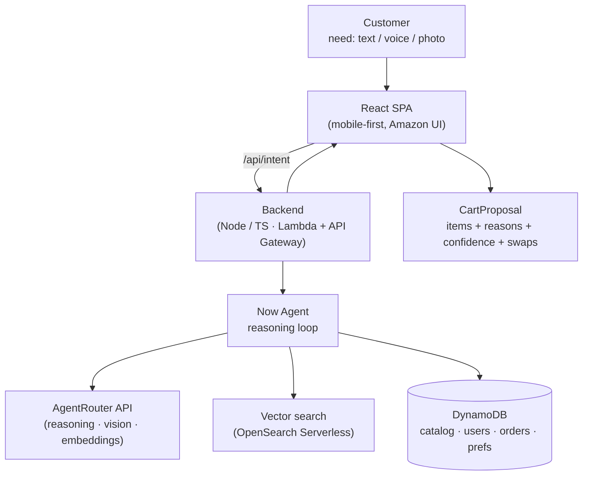

# Amazon Now

> **Delivery is fast. Now shopping is too.**

An AI shopping agent that turns a customer's *need* — typed, spoken, or **photographed** — into a ready-to-buy, budget-checked cart in **seconds**, and explains every choice. Built for **HackOn with Amazon — Season 6.0**, Problem Statement 2: *Amazon Now — Reimagining Urgent Shopping*.

---

## The problem

Quick-commerce delivery is already solved — orders arrive in minutes. **Shopping itself is not.** Customers arrive with an immediate need but still have to *search, compare, build a cart, and spend minutes deciding.* The friction lives **between the need and the done.**

| What customers do today | What they actually want |
|---|---|
| Search · Compare · Build the cart · Decide | Solve the need · Minimal effort · Done in seconds |

## Our answer

You tell Amazon Now your *outcome*, not the products. The **Now Agent** figures out the rest — and shows you *why* it chose what it did. We don't rebuild Amazon's storefront, payments, or logistics; we build the **intelligence layer** on top.

> "kal subah breakfast, 2 log, under ₹300" — or a photo of your empty fridge — becomes a complete, budget-checked cart. One tap to buy.

---

## Features

**Core**
- **Intent-to-Cart** — a stated need becomes one ready cart, with a one-line reason per item. *(Shopping by Intent)*
- **Multimodal intent** — snap a photo of an empty fridge, a handwritten list, a product box, or a recipe; the agent reads it and builds the cart. *(Innovative thinking)*
- **Budget rebalancing with live swaps** — over budget? The agent re-optimizes in front of you, swaps to cheaper equivalents ("saved ₹40, same quantity"), and lets you revert. *(Frictionless)*
- **Recipe / occasion-to-cart** — "Paneer butter masala for 4" or "Diwali for 10 guests" → ingredients scaled to servings, minus the staples you likely already own. *(Customer obsession)*

**Predictive**
- **Context-aware proactivity** — pre-builds carts from weather (heatwave → cold drinks + ORS; rain → khichdi), the festival calendar (Holi, Navratri vrat, Jain), and your calendar.
- **Consumption-rate prediction** — models how fast you use things ("2-day milk cycle → out Thursday"), not just what you bought before.
- **Emergency mode** — one tap surfaces a pre-decided essentials bundle for an urgent moment.

**Confidence and polish (woven into every cart)**
- **One-pick decision** — picks THE single best item with a confidence score and a "why this", with a quiet "show alternatives" escape hatch. Kills the compare step.
- **Substitution resilience** — out-of-stock items auto-swap to the closest match with a note; the cart never breaks.
- **Learns from your edits** — remove or swap an item and the agent remembers for next time.
- **Health/diet-aware swaps** — respects diabetic / vegan / allergy / Jain profiles and suggests healthier options.
- **Unit-economics nudges** — "buy the 1kg, cheaper per gram and you'll finish it."

### The trust layer
Every agent-built cart shows **why** each item is there. Confidence without comparison — that is the whole point.

---

## Architecture

LLM reasoning, image understanding, and embeddings run through **AgentRouter** (an OpenAI-compatible LLM gateway). Everything else runs on, and deploys to, **AWS**.



**Stack:** AgentRouter (LLM/vision/embeddings) · Lambda + API Gateway · DynamoDB · OpenSearch Serverless (vector) · S3 + CloudFront · Cognito · Secrets Manager — all in `ap-south-1`.

**Live prototype simplifications (deliberate):** in-memory vector search, single seeded demo user, static festival calendar + public weather API for proactivity, single Node service (Lambda-structured). The production-vs-prototype gap is a stated design decision.

---

## Tech stack

| Layer | Choice |
|---|---|
| Frontend | React + TypeScript + Vite + Tailwind (mobile-first) |
| Backend | Node.js + TypeScript (Express, Lambda-ready) |
| AI | AgentRouter API (OpenAI-compatible) — reasoning, vision, embeddings |
| Data | DynamoDB / seeded JSON + vector index |
| Infra | AWS (ap-south-1), built with Kiro |

---

## Getting started

### Prerequisites
- Node.js 18+
- An **AgentRouter** account + API key ([agentrouter.org](https://agentrouter.org)) — note your chat (vision-capable) and embedding model IDs
- AWS account + credentials (for deployment)

### Setup
```bash
cd backend && npm install
cd ../frontend && npm install

# backend/.env (git-ignored)
AGENTROUTER_BASE_URL=https://agentrouter.org/v1
AGENTROUTER_API_KEY=<your-key>
AGENTROUTER_MODEL=<vision-capable chat model id>
AGENTROUTER_EMBED_MODEL=<embedding model id>
AWS_REGION=ap-south-1

cd backend && npm run seed     # generate + embed the seed catalog
npm run dev                    # backend
cd ../frontend && npm run dev  # frontend
```

> AgentRouter is OpenAI-compatible: use the OpenAI SDK and override `baseURL` to `https://agentrouter.org/v1`. Send images as base64 `image_url` blocks to a vision-capable model.

---

## How the Now Agent works

1. **Parse intent** — text, voice, or image → structured goal + constraints.
2. **Get context** — household, dietary profile, budget, history, learned preferences.
3. **Decompose** — recipes/occasions into sub-needs, scaled to servings.
4. **Search** — semantic + filtered retrieval per sub-need.
5. **Assemble** — one best pick per slot; prefer past reorders; substitute if out of stock.
6. **Rebalance** — keep within budget by swapping to cheaper equivalents.
7. **Explain** — output a cart with a reason, confidence, and any nudge per item.

The agent is decisive by design: **one** good cart, not a list to compare.

---

## Vision — Think Big

- Voice-first urgent shopping ("I have guests in an hour").
- Population-scale proactive carts that appear before the customer opens the app.
- Multi-language intent across India's languages.
- Confidence as a moat — explainable carts that earn trust on every purchase.

From *need* to *done*, in seconds — for millions.

---

## Hackathon

HackOn with Amazon — Season 6.0 · 48hr · AWS Track · Problem Statement 2 (Amazon Now). Built with Kiro, AgentRouter, and AWS.
