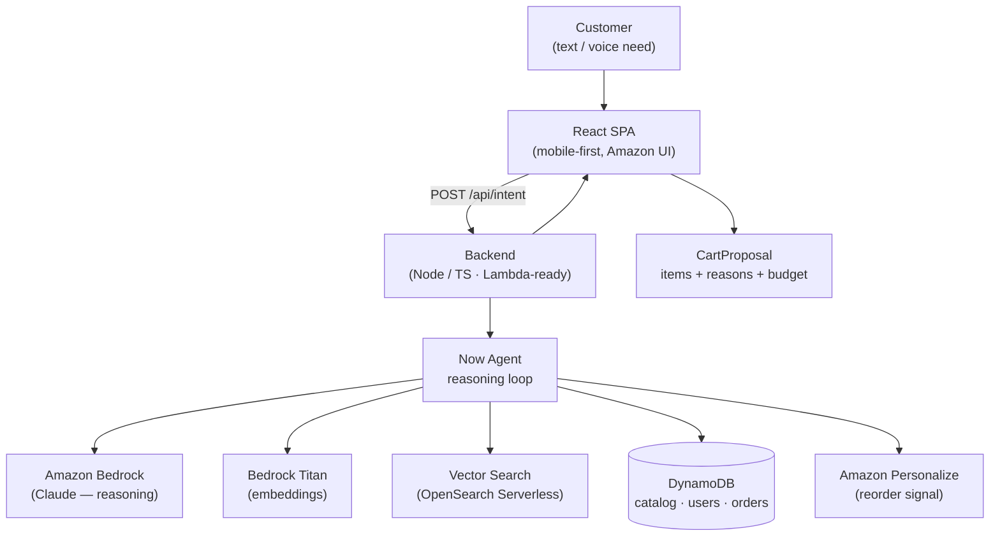

# Amazon Now

> **Delivery is fast. Now shopping is too.**

An AI shopping agent that turns a customer's *need*, stated in plain language, into a ready-to-buy cart in **seconds** — and explains every choice. Built for **HackOn with Amazon — Season 6.0**, Problem Statement 2: *Amazon Now — Reimagining Urgent Shopping*.

---

## The problem

Quick-commerce delivery is already a solved problem — orders arrive in minutes. **Shopping itself is not.** Customers arrive with an immediate need but still have to *search, compare, build a cart, and spend minutes deciding.*

The friction lives **between the need and the done**:

| What customers do today | What customers actually want |
|---|---|
| Search | Solve the need |
| Compare | Minimal effort |
| Build the cart manually | Done in seconds |
| Spend minutes deciding | — |

## Our answer

**Amazon Now removes the search → compare → build → decide loop.** You tell it your *outcome*, not the products. The Now Agent figures out the rest.

> "kal subah breakfast, 2 log, under ₹300" → a complete, budget-checked cart, one tap to buy.

We don't rebuild Amazon's storefront, payments, or logistics. We build the **intelligence layer on top** of it.

---

## Key features

### 1. Intent-to-Cart  *(hero)*
State a need in plain English or Hinglish. The agent interprets intent, pulls your household context, searches the catalog semantically, assembles a single ready-to-buy cart, and shows a one-line reason for every item.
→ *Shopping by Intent + Frictionless Shopping*

### 2. Emergency Mode
One tap surfaces a pre-decided essentials bundle for an urgent moment — sick, guests arriving, ran out of staples. Optimised for the absolute minimum number of taps.
→ *Predictive & Confident*

### 3. Smart Reorder
Learns from your purchase history and proposes what you're about to run out of — *before* you go looking for it.
→ *Predictive & Confident + instant re-orders*

### The trust layer
Every cart the agent builds shows **why** each item is there ("under budget", "you reordered this twice", "lighter for a headache"). Confidence without comparison — that is the whole point.

---

## Architecture

We designed the production-grade system and run a slim version live; the gap is a deliberate, scalable design decision.



**Production stack:** Bedrock (Claude) · Titan Embeddings · OpenSearch Serverless · DynamoDB · Lambda + API Gateway · Personalize · Cognito · S3 + CloudFront, all in `ap-south-1`.

**Live prototype simplifications:** in-memory vector search, single seeded demo user, heuristic reorder, single Node service (Lambda-structured). These are stated explicitly as prototype-vs-production decisions.

---

## Tech stack

| Layer | Choice |
|---|---|
| Frontend | React + TypeScript + Vite + Tailwind (mobile-first) |
| Backend | Node.js + TypeScript (Express, Lambda-ready) |
| AI | AWS Bedrock — Claude (reasoning) + Titan (embeddings) |
| Data | DynamoDB / seeded JSON; vector index for semantic search |
| Infra | AWS (ap-south-1), built with Kiro |

---

## Project structure

```
amazon-now/
├── agent.md          # full technical context (read this first)
├── README.md
├── PRD.md            # product requirements (hackathon deliverable)
├── frontend/         # React SPA
├── backend/          # API + Now Agent + services
├── scripts/          # catalog generation + embeddings
└── docs/             # architecture
```

---

## Getting started

### Prerequisites
- Node.js 18+
- An AWS account with **Amazon Bedrock access enabled** in `ap-south-1` (request model access for Claude + Titan in the Bedrock console)
- AWS credentials configured locally (`aws configure` or a named profile)

### Setup
```bash
# 1. install
cd backend && npm install
cd ../frontend && npm install

# 2. configure environment (backend/.env — git-ignored)
AWS_REGION=ap-south-1
BEDROCK_MODEL_ID=<your-claude-model-id>
BEDROCK_EMBED_MODEL_ID=<your-titan-embed-model-id>

# 3. generate + embed the seed catalog
cd backend && npm run seed

# 4. run
npm run dev          # backend
cd ../frontend && npm run dev   # frontend
```

> Confirm the exact Bedrock model IDs available in your console — they change over time. Use the latest available Claude model.

---

## How the Now Agent works

1. **Parse intent** — turn the need into a structured goal + constraints.
2. **Get context** — household size, dietary prefs, budget, recent orders.
3. **Search** — semantic + filtered retrieval over the catalog per sub-need.
4. **Assemble** — pick items and quantities; prefer past reorders that fit.
5. **Validate** — keep the cart within budget and dietary constraints.
6. **Explain** — output a `CartProposal` with a reason for every item.

The agent is decisive by design: it proposes **one** good cart, not a list to compare.

---

## Vision — Think Big

- **Voice-first** urgent shopping ("Alexa, I have guests in an hour").
- **Proactive need prediction** at population scale via Personalize, surfacing carts before the customer even opens the app.
- **Multi-language** intent across India's languages, not just English/Hinglish.
- **Confidence as a moat** — explainable carts that earn trust on every purchase, turning quick-commerce from "search and stress" into "say it and done."

From *need* to *done*, in seconds — for millions.

---

## Hackathon

HackOn with Amazon — Season 6.0 · 48hr Hackathon Challenge · AWS Track · Problem Statement 2 (Amazon Now). Built with Kiro + AWS credits.
